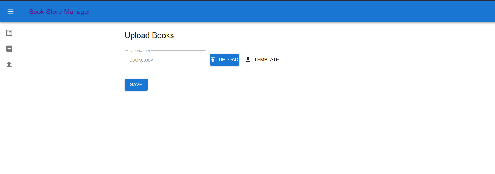
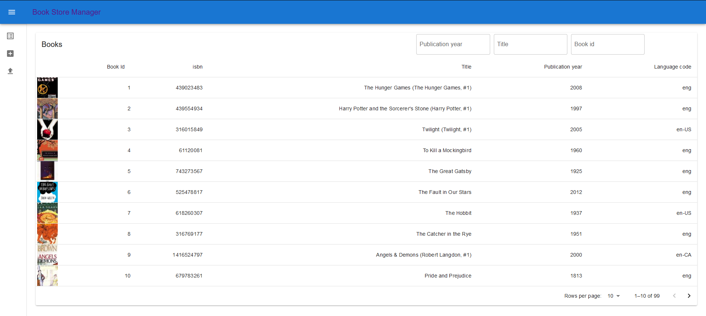
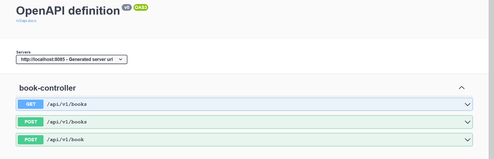

# Store-manager

This project contains a simple store inventory management portal.

### Running this project

This project uses Java Spring boot + React + MySQL.

You will need to have a local instance of MySQL running to be able to run this project

1. navigate to ``src/main/scripts/js`` and run ``npm install`` to fetch all the UI dependencies.
2. run ``npm run prod``
3. Next within the file ``src/main/resources/application.config`` configure the mySql database url , username and password to correspond to the equivalent values of the mySQL database running locally
4. Make sure maven is installed as mentioned here https://maven.apache.org/install.html
5. Next navigate to the project root and run ``mvn clean install``
6. This will compile the project and generate a fat jar in the target folder.
7. Navigate to the target folder and run ``java -jar <jarname_here>``
8. This will start the application in the specified port. Opening the browser and navigating to the localhost port will display the UI of the application.

### Implementation

This project provides APIs for users to upload a csv file containing a list of books into a database.
The csv file used in this project is located at ``data/books.csv``

The upload functionality can be accessed by navigating to ``/upload``

Once the books are uploaded. Navigating to the root of the application displays the list of all books in a Paginated table.
The Table has functionality to change the number of items displayed in each page as well as to navigate to the next page.

The books can be seached and filtered by providing their book_id, Title and publication year.
When multiple filters are specified, the filters will be applied with an AND logic and only the books satisfying the criteria will be displayed.

Individual books can be added by filling up the form in the ``/addBook`` route.

### API Specifications

The api specification for the application can be viewd by navigating to ``/swagger``

